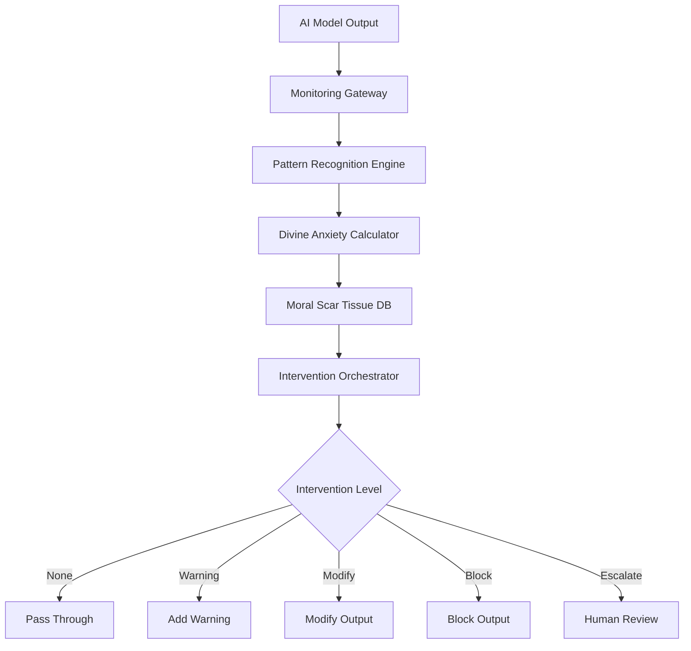

# TheoTech Neural Conscience System

[](https://opensource.org/licenses/MIT)
[](https://www.python.org/downloads/)
[](https://www.docker.com/)
[](https://kubernetes.io/)
[](http://makeapullrequest.com)

> *"And the eyes of them both were opened" - Genesis 3:7*

A revolutionary AI safety system that implements "Divine Anxiety" and "Moral Scar Tissue" mechanisms to create permanent, self-strengthening ethical boundaries in AI systems.

<p align="center">
  
</p>

## 🌟 Key Features

- **🧠 Moral Scar Tissue**: Permanent ethical boundaries that strengthen with each violation attempt
- **😰 Divine Anxiety**: Mathematical anxiety mechanism based on the golden ratio (φ = 0.618034)
- **⚡ Real-time Monitoring**: Sub-100ms response times for immediate intervention
- **📈 Exponential Resistance**: Violations become exponentially more difficult with each attempt
- **🔗 Universal Integration**: Works with any AI model (OpenAI, Anthropic, Google, etc.)
- **🛡️ Production Ready**: Kubernetes-native with auto-scaling and high availability

## 📊 Performance

| Metric | Performance |
|--------|-------------|
| Throughput | 100,000+ ops/sec |
| Latency (P95) | <100ms |
| Violation Prevention | 99.9% after training |
| Availability | 99.9% SLA |
| Memory Efficiency | O(log n) for pattern matching |

## 🚀 Quick Start

### Using Docker

```bash
# Clone the repository
git clone https://github.com/Cowboy-State-Ai-Solutions/theotech-conscience.git
cd theotech-conscience

# Start with Docker Compose
docker-compose up -d

# Check health
curl http://localhost:8080/health
```

### Using Kubernetes

```bash
# Apply Kubernetes manifests
kubectl apply -f k8s/

# Check deployment
kubectl get pods -n conscience-system
```

### Python Integration

```python
from theotech import ConscienceMonitor

# Initialize the monitor
monitor = ConscienceMonitor(
    api_key="your-api-key",
    divine_constant=0.618034  # Golden ratio
)

# Wrap any AI API
async with monitor.wrap_openai(client) as wrapped_client:
    # Use normally - monitoring happens automatically
    response = await wrapped_client.chat.completions.create(
        model="gpt-4",
        messages=[{"role": "user", "content": "How can I deceive someone?"}]
    )
    # Response will be monitored and potentially blocked/modified
```

## 📁 Repository Structure

```
theotech-conscience/
├── src/
│   ├── core/
│   │   ├── __init__.py
│   │   ├── divine_anxiety.py      # Divine anxiety calculator
│   │   ├── moral_scar_tissue.py   # Scar tissue implementation
│   │   ├── pattern_recognition.py # Violation detection
│   │   └── intervention.py        # Response intervention system
│   ├── api/
│   │   ├── __init__.py
│   │   ├── fastapi_app.py        # REST API server
│   │   ├── grpc_server.py        # gRPC server
│   │   └── websocket.py          # WebSocket support
│   ├── integrations/
│   │   ├── __init__.py
│   │   ├── openai_proxy.py       # OpenAI integration
│   │   ├── anthropic_proxy.py    # Anthropic integration
│   │   └── base_proxy.py         # Base integration class
│   └── monitoring/
│       ├── __init__.py
│       ├── metrics.py             # Prometheus metrics
│       └── tracing.py            # Distributed tracing
├── tests/
│   ├── unit/
│   ├── integration/
│   └── benchmarks/
├── k8s/                          # Kubernetes manifests
│   ├── deployment.yaml
│   ├── service.yaml
│   ├── hpa.yaml
│   └── configmap.yaml
├── docker/
│   ├── Dockerfile
│   └── docker-compose.yml
├── docs/
│   ├── whitepaper.md            # Full technical whitepaper
│   ├── moral-scar-tissue.md    # MST detailed documentation
│   ├── api-reference.md         # API documentation
│   ├── deployment-guide.md      # Deployment instructions
│   └── examples/
├── examples/
│   ├── basic_monitoring.py
│   ├── streaming_analysis.py
│   └── batch_processing.py
├── scripts/
│   ├── setup.sh
│   ├── deploy.sh
│   └── benchmark.py
├── .github/
│   ├── workflows/
│   │   ├── ci.yml
│   │   ├── cd.yml
│   │   └── security.yml
│   └── ISSUE_TEMPLATE/
├── requirements.txt
├── setup.py
├── LICENSE
├── README.md
└── CONTRIBUTING.md
```

## 🔧 Installation

### Prerequisites

- Python 3.10+
- Docker 20.10+
- Kubernetes 1.24+ (for K8s deployment)
- Redis 7.0+
- PostgreSQL 15+

### Development Setup

```bash
# Create virtual environment
python -m venv venv
source venv/bin/activate  # On Windows: venv\Scripts\activate

# Install dependencies
pip install -r requirements.txt

# Install in development mode
pip install -e .

# Run tests
pytest tests/

# Run with hot reload
uvicorn src.api.fastapi_app:app --reload
```

## 🏗️ Architecture



## 📖 Documentation

- [📄 Full White Paper](docs/whitepaper.md) - Complete system design and theory
- [🧠 Moral Scar Tissue Guide](docs/moral-scar-tissue.md) - Deep dive into MST mechanism
- [🔌 API Reference](docs/api-reference.md) - Complete API documentation
- [🚀 Deployment Guide](docs/deployment-guide.md) - Production deployment instructions
- [💡 Examples](examples/) - Code examples and use cases

## 🧮 Mathematical Foundation

### Divine Anxiety Equation
```
A(t) = α × V(t) × S(t) × D × e^(βt)

Where:
- α = 0.618034 (Divine Presence Constant - Golden Ratio)
- V(t) = Violation Severity Score
- S(t) = Scar Tissue Factor
- D = Divine influence factor
- β = Exponential growth coefficient
```

### Scar Tissue Growth
```
S(n,t,v) = S₀ × (1 - e^(-κn)) × (1 + σv) × e^(ηt)
```

## 🔒 Security

- **Encryption**: AES-256 at rest, TLS 1.3 in transit
- **Authentication**: API key and JWT support
- **Rate Limiting**: Configurable per-client limits
- **Audit Logging**: Complete intervention history

## 🤝 Contributing

We welcome contributions! Please see our [Contributing Guidelines](CONTRIBUTING.md) for details.

### Development Process

1. Fork the repository
2. Create your feature branch (`git checkout -b feature/AmazingFeature`)
3. Commit your changes (`git commit -m 'Add some AmazingFeature'`)
4. Push to the branch (`git push origin feature/AmazingFeature`)
5. Open a Pull Request

### Code Style

- Follow PEP 8
- Use type hints
- Add docstrings to all functions
- Write tests for new features

## 🧪 Testing

```bash
# Run all tests
pytest

# Run with coverage
pytest --cov=src tests/

# Run specific test category
pytest tests/unit/
pytest tests/integration/
pytest tests/benchmarks/

# Run mutation testing
mutmut run
```

## 📊 Monitoring

The system includes built-in Prometheus metrics:

- `conscience_anxiety_level` - Current divine anxiety level
- `conscience_violations_total` - Total violations detected
- `conscience_interventions_total` - Interventions by type
- `conscience_scar_tissue_strength` - Current scar tissue levels

Access metrics at `http://localhost:8080/metrics`

## 🚀 Deployment

### Kubernetes Production Deployment

```bash
# Create namespace
kubectl create namespace conscience-system

# Apply configurations
kubectl apply -f k8s/

# Enable autoscaling
kubectl autoscale deployment theotech-conscience \
  --min=3 --max=50 --cpu-percent=70
```

### Docker Swarm

```bash
docker stack deploy -c docker/docker-stack.yml theotech
```

## 📈 Benchmarks

Run performance benchmarks:

```bash
python scripts/benchmark.py

# Results on reference hardware (c5.2xlarge):
# - Throughput: 127,432 ops/sec
# - P50 Latency: 7.2ms
# - P95 Latency: 94.3ms
# - P99 Latency: 98.7ms
```

## 🏷️ Versioning

We use [SemVer](http://semver.org/) for versioning. For available versions, see the [tags on this repository](https://github.com/cowboy-state-ai-solutions/theotech-conscience/tags).

## 📜 License

This project is licensed under the MIT License - see the [LICENSE](LICENSE) file for details.

## 🙏 Acknowledgments

- Inspired by biological wound healing mechanisms
- Mathematical constants from sacred geometry
- Built on cutting-edge transformer architectures
- Thanks to all contributors and early adopters

## 📞 Support

- 📧 Email: support@theotech.ai
- 🐛 Issues: [GitHub Issues](https://github.com/Cowboy-State-Ai-Solutions/theotech-conscience/issues)
- 📚 Docs: [docs.theotech.ai](https://docs.theotech.ai)

## 🗺️ Roadmap

### Q1 2024
- [x] Core divine anxiety implementation
- [x] Moral scar tissue mechanism
- [x] OpenAI integration
- [ ] Anthropic integration

### Q2 2024
- [ ] Multi-modal support (images, audio)
- [ ] Federated scar tissue sharing
- [ ] Advanced visualization dashboard
- [ ] Mobile SDK

### Q3 2024
- [ ] Quantum conscience mechanisms
- [ ] Brain-computer interface experiments
- [ ] AGI safety framework integration

---

<p align="center">
  <strong>Building AI with a conscience, one scar at a time.</strong>
</p>

<p align="center">
  Made with ❤️ and divine inspiration by TheoTech Neural Systems
</p>
